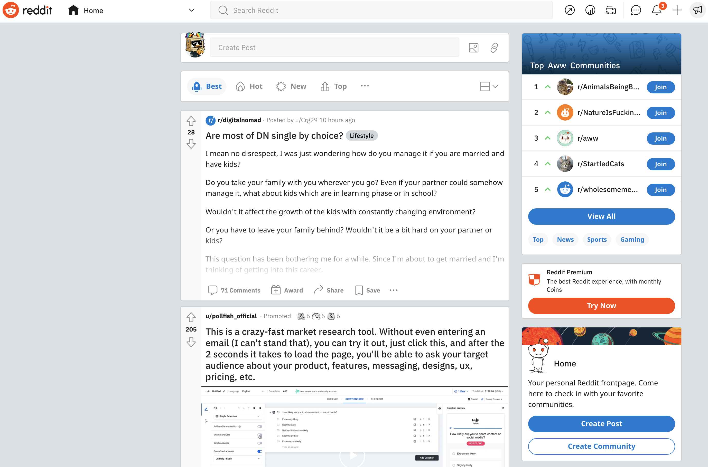
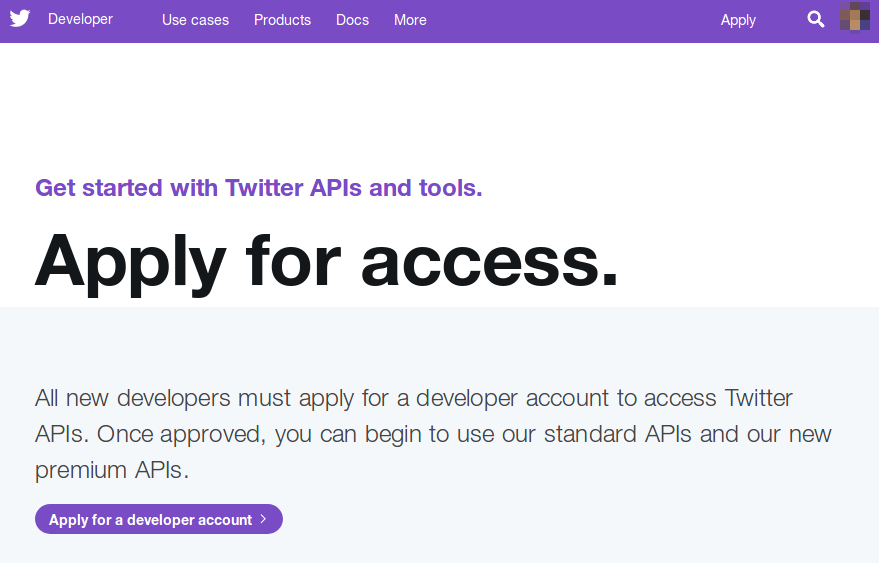
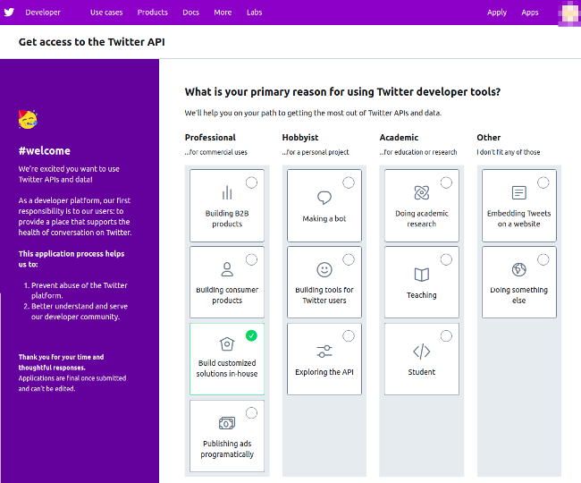
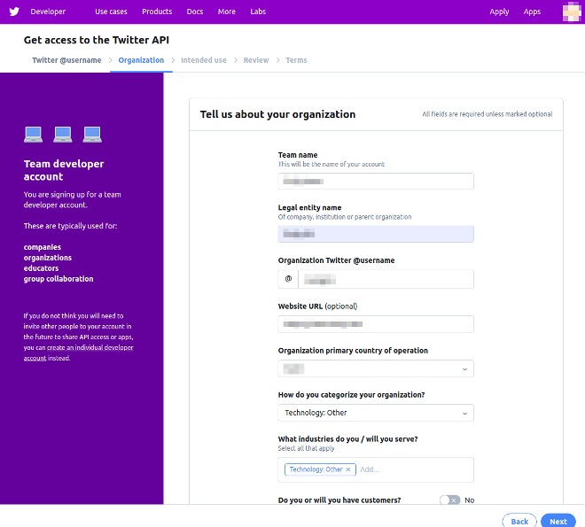
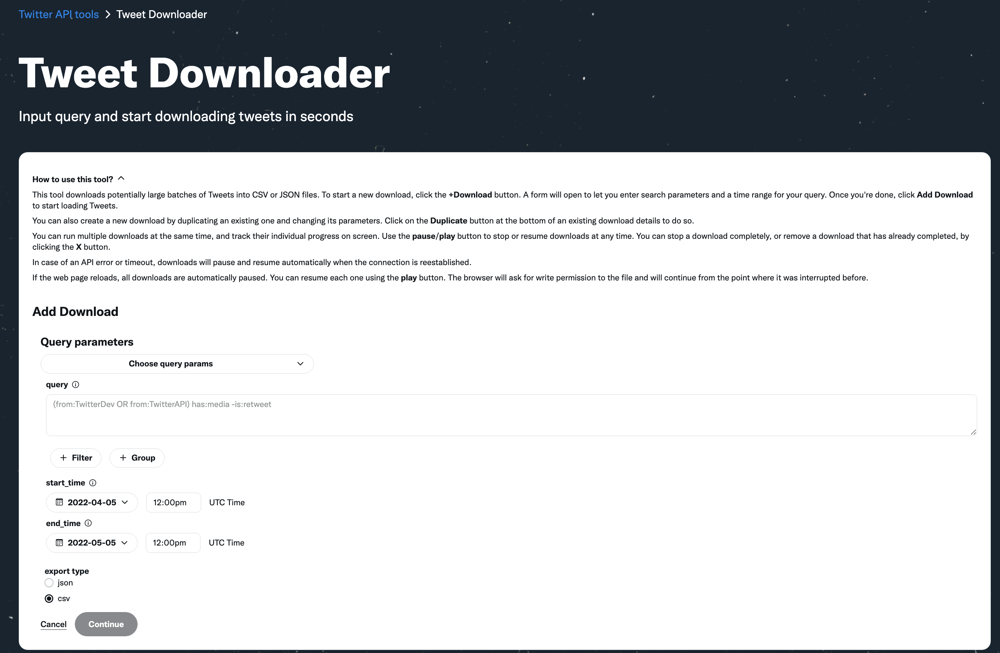
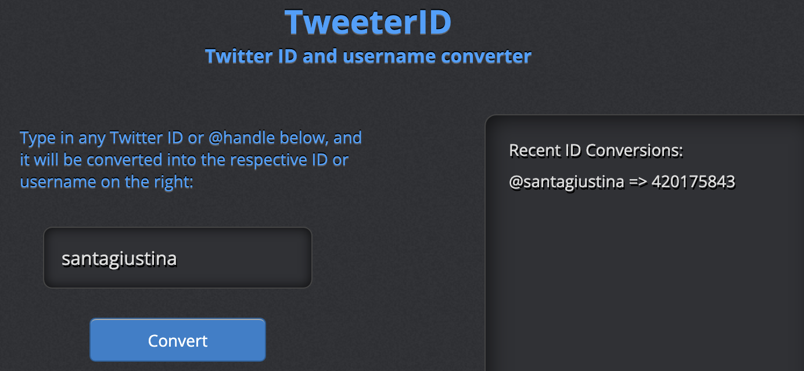

```{r setup, include=FALSE}
options(warn = -1)
install_and_load <- function(pkg){
  new.pkg <- pkg[!(pkg %in% installed.packages()[, "Package"])]

  if (length(new.pkg)) 
    install.packages(new.pkg, dependencies = TRUE, repos="http://cran.rstudio.com")
  sapply(pkg, require, character.only = TRUE)
}

packages <- c("learnr","httr","knitr","rapiclient","keyring","htmltools","rtweet","academictwitteR","DT","RedditExtractoR")
install_and_load (packages)
#install_and_load("remotes")
#install_version("RedditExtractoR", version = "2.1.5", repos = "http://cran.us.r-project.org") #If you have an earlier version of R (<4.1)and are not ready to upgrade, then you can install the earlier version of the RedditExtractoR package with install_version("RedditExtractoR", version = "2.1.5", repos = "http://cran.us.r-project.org")
knitr::opts_chunk$set(echo = FALSE)

#Authentication
#credentials had been previusly stored in a secure way using the following keyring command
#key_set_with_value(service = "TWITTER_DEV_BEARER",password = "MY_BEARER_TOKEN")
dev_app = rtweet::rtweet_app(bearer_token = keyring::key_get("TWITTER_DEV_BEARER"))
rtweet::auth_as(dev_app)
```


## Outline


This short tutorial will help you understand how to use R, RStudio and its libraries to download data from social media platforms, like:


<center> [Reddit](https://www.reddit.com/){style="font-size:30px"} </center>
<center>{width=140px}</center>
<br><br>
<center> [Twitter](https://twitter.com/home){style="font-size:30px"} </center>
<center>{width=100px} </center>

<br><br>
To download social media data with R you will have to:

* Install R
* Install the RStudio IDE (optional)
* Subscribe to Twitter and to the Twitter Developer portal
* Install and load R packages used to download data from social media
* Send a GET/POST request to one of the API endpoints of a social media and parse the answer


<br>
to collect Reddit data with R you can: 

* Use `RedditExtractoR` to rapidly retrieve and parse data from specific Reddit API endpoints (e.g., Search)
<br>
to collect Twitter data with R you can: 

* Use `rtweet` to rapidly retrieve and parse data from specific Twitter API endpoints, like User, Search and Stream.
* Use `academictwitteR` to rapidly retrieve data from the Twitter fullArchive V2 API endpoint (**only for Academic accounts**).

<br>

### Is this tutorial for you?

Do you need to work through the tutorial? Take the quiz below to find out.


```{r quiz1, echo = FALSE}
question("Check all that you have NOT done:",
  answer("installed R on my computer", message = "* Install R"),
  answer("installed the RStudio IDE", message = "* Install RStudio IDE"),
  answer("installed the required R package", message = "* Install Packages"),
  answer("sent a request to a social media API endpoint using R", message = "* R libraries for downloading social media data"),
  answer("None of the above. I've done them all.", correct = TRUE, message = "You can skip this tutorial!"),
  type = "multiple",
  incorrect = "This tutorial is here to help! To get set up read:"
)
```

## A short intro to Social Media data

### Reddit and its data

<br><br>
[Reddit.com](Reddit.com) was founded by Alexis Ohanian and Steve Huffman in 2005.
Reddit is a community-based news/opinion aggregator and rating system, where users can discuss issues of collective interest in depth, like in a forum. 
<br><br>
<center>{width=100%} </center>
<br><br>

#### Redditsphere metrics

<br><br>

* There are +-50 million daily active Reddit users worldwide.
* About 50% of Reddit’s traffic comes from US users.
* Reddit users spend on average +- 10 minutes per visit on Reddit.
* Reddit is the most popular among users aged 25 to 30. +-25% of US adults in this age range use Reddit.
* Reddit hosts more than 130,000 active communities and more than 2.8 million subreddits.

<br><br>

#### Reddit API endpoints


All Reddit endpoints are described at the following link:
[https://www.reddit.com/dev/api/#fullnames](https://www.reddit.com/dev/api/#fullnames)
<br><br>


**Example: SEARCH endpoint**

<br>

<div class="endpoint" id="GET_search"><h3><span class="method">GET&nbsp;</span>[/r/<em class="placeholder">subreddit</em>]/search<span class="oauth-scope-list"><a href="https://github.com/reddit/reddit/wiki/OAuth2"><br><span class="api-badge oauth-scope">read</span></a></span><br><a href="https://www.reddit.com/wiki/rss"><span class="api-badge rss-support">rss support</span></a></h3><div class="info"><div class="md"><p>Search links page.</p>

<p><em>This endpoint is <a href="#listings">a listing</a>.</em></p>
</div>
<table class="parameters"><tbody><tr><th scope="row">after</th><td><p><a href="#fullnames">fullname</a> of a thing</p>

</td></tr><tr><th scope="row">before</th><td><p><a href="#fullnames">fullname</a> of a thing</p>

</td></tr><tr><th scope="row">category</th><td><p>a string no longer than 5 characters</p>

</td></tr><tr><th scope="row">count</th><td><p>a positive integer (default: 0)</p>

</td></tr><tr><th scope="row">include_facets</th><td><p>boolean value</p>

</td></tr><tr><th scope="row">limit</th><td><p>the maximum number of items desired (default: 25, maximum: 100)</p>

</td></tr><tr><th scope="row">q</th><td><p>a string no longer than 512 characters</p>

</td></tr><tr><th scope="row">restrict_sr</th><td><p>boolean value</p>

</td></tr><tr><th scope="row">show</th><td><p>(optional) the string <code>all</code></p>

</td></tr><tr><th scope="row">sort</th><td><p>one of (<code>relevance</code>, <code>hot</code>, <code>top</code>, <code>new</code>, <code>comments</code>)</p>

</td></tr><tr><th scope="row">sr_detail</th><td><p>(optional) expand subreddits</p>

</td></tr><tr><th scope="row">t</th><td><p>one of (<code>hour</code>, <code>day</code>, <code>week</code>, <code>month</code>, <code>year</code>, <code>all</code>)</p>

</td></tr><tr><th scope="row">type</th><td><p>(optional) comma-delimited list of result types (<code>sr</code>, <code>link</code>, <code>user</code>)</p>

</td></tr></tbody></table></div></div>

<br><br>

### A human-readable Reddit post on the worldnews subReddit

<br><br>
<iframe id="reddit-embed" src="https://www.redditmedia.com/r/worldnews/comments/uj8ete/us_intel_helped_ukraine_sink_russian_flagship/?ref_source=embed&amp;ref=share&amp;embed=true" sandbox="allow-scripts allow-same-origin allow-popups" style="border: none;" height="127" width="640" scrolling="no"></iframe>

<br><br>

#### A machine-readable filtered subReddit (in .json)

<br><br>
You can filter the same subReddit and retrieve the aforementioned post in a machine-readable format invoking a curl GET request on your terminal:

**curl -X GET "https://www.reddit.com/r/worldnews/search.json?q=%22U.S.%20intel%20helped%20Ukraine%20sink%20Russian%20flagship%20Moskva%2C%20officials%20say%22&restrict_sr=1&raw_json=1"**

```{r jsonreddit, exercise=FALSE, eval=TRUE, exercise.lines = 3}
Sys.sleep(3)
json_reddit=system(command = 'curl -X GET "https://www.reddit.com/r/worldnews/search.json?q=%22U.S.%20intel%20helped%20Ukraine%20sink%20Russian%20flagship%20Moskva%2C%20officials%20say%22&restrict_sr=1&raw_json=1"',intern = TRUE)
print(json_reddit)
```
<br><br>

or by entering this URL query in your browser:<br>
[https://www.reddit.com/r/worldnews/search.json?q=%22U.S.%20intel%20helped%20Ukraine%20sink%20Russian%20flagship%20Moskva%2C%20officials%20say%22&restrict_sr=1&raw_json=1](https://www.reddit.com/r/worldnews/search.json?q=%22U.S.%20intel%20helped%20Ukraine%20sink%20Russian%20flagship%20Moskva%2C%20officials%20say%22&restrict_sr=1&raw_json=1)

<br><br>


### Twitter and its data

[Twitter.com](Twitter.com) was founded Jack Dorsey, Noah Glass, Biz Stone, and Evan Williams in March 2006. Twitter is an open microblogging and news posting platform based on very short posts, also known as tweets. 
 
<br><br>
<center>{width=100%} </center>
<br><br>

#### Twittersphere metrics

<br><br>

* There are +-190 million daily active users on Twitter.
* +-60% of all Twitter users (worldwide) are between 35 and 65.
* The ratio of female to male Twitter users is roughly one to two.
* The average session on Twitter is +-3 minutes.
* +-500 million tweets are sent out per day.

<br><br>

#### Twitter API endpoints, versions and account types
<br><br>

<table>
<thead><tr><th width="10%">&nbsp;</th>
<th>Standard v1.1</th>
<th>Premium v1.1</th>
<th>Enterprise</th>
<th>Twitter API v2</th>
</tr></thead><tbody><tr><td rowspan="18"><b>Tweets</b></td>
<td><a href="https://developer.twitter.com/en/products/twitter-api/tweets/post-and-engage/api-reference/get-statuses-show-id">GET statuses/show</a><br>
<a href="https://developer.twitter.com/en/products/twitter-api/tweets/post-and-engage/api-reference/get-statuses-lookup">GET statuses/lookup</a></td>
<td>&nbsp;</td>
<td>&nbsp;</td>
<td><a href="https://developer.twitter.com/en/docs/twitter-api/tweets/lookup/introduction">Tweets lookup</a></td>
</tr><tr><td><a href="https://developer.twitter.com/en/docs/twitter-api/v1/tweets/post-and-engage/api-reference/post-statuses-update">POST statuses/update</a><br>
<a href="https://developer.twitter.com/en/docs/twitter-api/v1/tweets/post-and-engage/api-reference/post-statuses-destroy-id">POST statuses/destroy/:id</a></td>
<td>&nbsp;</td>
<td>&nbsp;</td>
<td><a href="https://developer.twitter.com/en/docs/twitter-api/tweets/manage-tweets/introduction">Manage Tweets</a></td>
</tr><tr><td><a href="https://developer.twitter.com/en/docs/twitter-api/v1/tweets/timelines/api-reference/get-statuses-user_timeline.html">GET statuses/user_timeline</a><br>
<a href="https://developer.twitter.com/en/docs/twitter-api/v1/tweets/timelines/api-reference/get-statuses-mentions_timeline.html">GET statuses/mentions_timeline</a><br>
<a href="https://developer.twitter.com/en/docs/twitter-api/v1/tweets/timelines/api-reference/get-statuses-user_timeline">GET statuses/home_timeline</a></td>
<td>&nbsp;</td>
<td>&nbsp;</td>
<td><a href="https://developer.twitter.com/en/docs/twitter-api/tweets/timelines/introduction">Timelines</a><br>
- User Tweet timeline<br>
- User mention timeline<br>
- User home timeline [<a href="https://trello.com/c/V8ylC6FZ/108-replacement-for-hometimeline-functionality">COMING SOON</a>]</td>
</tr><tr><td><a href="https://developer.twitter.com/en/docs/twitter-api/v1/tweets/search/overview">GET search/tweets (7 days)</a></td>
<td><a href="https://developer.twitter.com/en/docs/twitter-api/premium/search-api/overview">Search API</a><br>
- 30 day<br>
- Full-archive</td>
<td><a href="https://developer.twitter.com/en/docs/twitter-api/enterprise/search-api/overview">Search API</a><br>
- 30 day<br>
- Full-archive</td>
<td><a href="https://developer.twitter.com/en/docs/twitter-api/tweets/search/introduction">Search Tweets</a><br>
- Recent search<br>
- 30 day [Replacement under consideration]<br>
- Full-archive search</td>
</tr><tr><td>&nbsp;</td>
<td><a href="https://developer.twitter.com/en/docs/twitter-api/premium/search-api/overview">Search API</a><br>
- 30 day<br>
- Full-archive</td>
<td><a href="https://developer.twitter.com/en/docs/twitter-api/enterprise/search-api/overview">Search API</a><br>
- 30 day<br>
- Full-archive</td>
<td><a href="https://developer.twitter.com/en/docs/twitter-api/tweets/counts/introduction">Tweet counts</a><br>
- Recent Tweet counts<br>
- 30 day [Replacement under consideration]<br>
- Full-archive Tweet counts</td>
</tr><tr><td>&nbsp;</td>
<td>&nbsp;</td>
<td><a href="https://developer.twitter.com/en/docs/twitter-api/enterprise/historical-powertrack-api">Historical PowerTrack API</a></td>
<td>[Replacement under consideration]</td>
</tr><tr><td><a href="https://developer.twitter.com/en/docs/twitter-api/v1/tweets/filter-realtime/overview">GET statuses/filter</a></td>
<td>&nbsp;</td>
<td><a href="https://developer.twitter.com/en/docs/twitter-api/enterprise/powertrack-api/overview">PowerTrack API</a></td>
<td><a href="https://developer.twitter.com/en/docs/twitter-api/tweets/filtered-stream/introduction">Filtered stream</a><br>
- Connect to stream<br>
- Add/delete rules<br>
- Retrieve rules</td>
</tr><tr><td><a href="https://developer.twitter.com/en/docs/twitter-api/v1/tweets/sample-realtime/overview/get_statuses_sample">GET statuses/sample (1%)</a></td>
<td>&nbsp;</td>
<td><a href="https://developer.twitter.com/en/docs/twitter-api/enterprise/decahose-api">Decahose API</a><br>
Firehose API</td>
<td><a href="https://developer.twitter.com/en/docs/twitter-api/tweets/sampled-stream/introduction">Volume stream</a><br>
- 1% sampled stream<br>
- 10% decahose stream [COMING SOON]<br>
- 100% firehose stream [COMING SOON]</td>
</tr><tr><td><a href="https://developer.twitter.com/en/docs/twitter-api/v1/tweets/post-and-engage/api-reference/get-statuses-retweeters-ids">GET statuses/retweeters/:ids</a><br>
<a href="https://developer.twitter.com/en/docs/twitter-api/v1/tweets/post-and-engage/api-reference/get-statuses-retweets-id">GET statuses/retweets/:id</a></td>
<td>&nbsp;</td>
<td>&nbsp;</td>
<td><a href="https://developer.twitter.com/en/docs/twitter-api/tweets/retweets/introduction">Retweets lookup</a><br>
</td>
</tr><tr><td>&nbsp;</td>
<td>&nbsp;</td>
<td>&nbsp;</td>
<td><a>Quote Tweets lookup</a><br>
</td>
</tr><tr><td><a href="https://developer.twitter.com/en/docs/twitter-api/v1/tweets/post-and-engage/api-reference/post-statuses-retweet-id">POST statuses/retweet/:id</a><br>
<a href="https://developer.twitter.com/en/docs/twitter-api/v1/tweets/post-and-engage/api-reference/post-statuses-unretweet-id">POST statuses/unretweet/:id</a></td>
<td>&nbsp;</td>
<td>&nbsp;</td>
<td><a href="https://developer.twitter.com/en/docs/twitter-api/tweets/retweets/introduction">Manage Retweets</a><br>
- Retweet a Tweet<br>
- Undo a Retweet</td>
</tr><tr><td><a href="https://developer.twitter.com/en/docs/twitter-api/v1/tweets/post-and-engage/api-reference/get-favorites-list">GET favorites/list</a></td>
<td>&nbsp;</td>
<td>&nbsp;</td>
<td><a href="https://developer.twitter.com/en/docs/twitter-api/tweets/likes/introduction">Likes lookup</a><br>
- Tweets liked by a user<br>
- Users who have liked a Tweet [NEW]</td>
</tr><tr><td><a href="https://developer.twitter.com/en/docs/twitter-api/v1/tweets/post-and-engage/api-reference/post-favorites-create">POST favorites/create</a><br>
<a href="https://developer.twitter.com/en/docs/twitter-api/v1/tweets/post-and-engage/api-reference/post-favorites-destroy">POST favorites/destroy</a></td>
<td>&nbsp;</td>
<td>&nbsp;</td>
<td><a href="https://developer.twitter.com/en/docs/twitter-api/tweets/likes/introduction">Manage Likes</a><br>
- Like a Tweet<br>
- Unlike a Tweet</td>
</tr><tr><td>&nbsp;</td>
<td>&nbsp;</td>
<td>&nbsp;</td>
<td><a href="https://developer.twitter.com/en/docs/twitter-api/tweets/hide-replies/introduction">Hide replies</a> [NEW]</td>
</tr><tr><td>&nbsp;</td>
<td>&nbsp;</td>
<td>&nbsp;</td>
<td><a href="https://developer.twitter.com/en/docs/twitter-api/tweets/bookmarks/introduction">Bookmarks lookup</a></td>
</tr><tr><td>&nbsp;</td>
<td>&nbsp;</td>
<td>&nbsp;</td>
<td><a href="https://developer.twitter.com/en/docs/twitter-api/tweets/bookmarks/introduction">Manage Bookmarks</a></td>
</tr><tr><td><a href="https://developer.twitter.com/en/docs/twitter-api/v1/tweets/post-and-engage/api-reference/get-statuses-oembed">GET statuses/oembed</a></td>
<td>&nbsp;</td>
<td>&nbsp;</td>
<td>[Replacement under consideration]</td>
</tr><tr><td><a href="https://developer.twitter.com/en/docs/twitter-api/v1/tweets/post-and-engage/api-reference/get-statuses-retweets_of_me">GET statuses/retweets_of_me</a></td>
<td>&nbsp;</td>
<td>&nbsp;</td>
<td>[No replacement planned]</td>
</tr><tr><td rowspan="14"><b>Users</b></td>
<td><a href="https://developer.twitter.com/en/docs/twitter-api/v1/accounts-and-users/follow-search-get-users/api-reference/get-users-show">GET users/show</a><br>
<a href="https://developer.twitter.com/en/docs/twitter-api/v1/accounts-and-users/follow-search-get-users/api-reference/get-users-lookup">GET users/lookup</a></td>
<td>&nbsp;</td>
<td>&nbsp;</td>
<td><a href="https://developer.twitter.com/en/docs/twitter-api/users/lookup/introduction">Users lookup</a></td>
</tr><tr><td><a href="https://developer.twitter.com/en/docs/twitter-api/v1/accounts-and-users/follow-search-get-users/api-reference/get-users-search">GET users/search</a></td>
<td>&nbsp;</td>
<td>&nbsp;</td>
<td>[Replacement under consideration]</td>
</tr><tr><td><a href="https://developer.twitter.com/en/docs/twitter-api/v1/accounts-and-users/follow-search-get-users/api-reference/get-followers-ids">GET followers/ids</a><br>
<a href="https://developer.twitter.com/en/docs/twitter-api/v1/accounts-and-users/follow-search-get-users/api-reference/get-followers-list">GET followers/list</a><br>
<a href="https://developer.twitter.com/en/docs/twitter-api/v1/accounts-and-users/follow-search-get-users/api-reference/get-friends-ids">GET friends/ids</a><br>
<a href="https://developer.twitter.com/en/docs/twitter-api/v1/accounts-and-users/follow-search-get-users/api-reference/get-friends-list">GET friends/list</a></td>
<td>&nbsp;</td>
<td>&nbsp;</td>
<td><a href="https://developer.twitter.com/en/docs/twitter-api/users/follows">Follows lookup</a></td>
</tr><tr><td><a href="https://developer.twitter.com/en/docs/twitter-api/v1/accounts-and-users/follow-search-get-users/api-reference/get-friendships-incoming">GET friendships/incoming</a><br>
<a href="https://developer.twitter.com/en/docs/twitter-api/v1/accounts-and-users/follow-search-get-users/api-reference/get-friendships-lookup">GET friendships/lookup</a><br>
<a href="https://developer.twitter.com/en/docs/twitter-api/v1/accounts-and-users/follow-search-get-users/api-reference/get-friendships-no_retweets-ids">GET friendships/no_retweets/ids</a><br>
<a href="https://developer.twitter.com/en/docs/twitter-api/v1/accounts-and-users/follow-search-get-users/api-reference/get-friendships-outgoing">GET friendships/outgoing</a><br>
<a href="https://developer.twitter.com/en/docs/twitter-api/v1/accounts-and-users/follow-search-get-users/api-reference/get-friendships-show">GET friendships/show</a></td>
<td>&nbsp;</td>
<td>&nbsp;</td>
<td>[COMING SOON]</td>
</tr><tr><td><a href="https://developer.twitter.com/en/docs/twitter-api/v1/accounts-and-users/follow-search-get-users/api-reference/post-friendships-create">GET friendships/create</a><br>
<a href="https://developer.twitter.com/en/docs/twitter-api/v1/accounts-and-users/follow-search-get-users/api-reference/post-friendships-destroy">GET friendships/destroy</a></td>
<td>&nbsp;</td>
<td>&nbsp;</td>
<td><a href="https://developer.twitter.com/en/docs/twitter-api/users/follows">Manage follows</a><br>
- Follow a user<br>
- Unfollow a user</td>
</tr><tr><td><a href="https://developer.twitter.com/en/docs/twitter-api/v1/accounts-and-users/follow-search-get-users/api-reference/post-friendships-update">POST friendships/update</a></td>
<td>&nbsp;</td>
<td>&nbsp;</td>
<td>[Replacement under consideration]</td>
</tr><tr><td><a href="https://developer.twitter.com/en/docs/twitter-api/v1/accounts-and-users/mute-block-report-users/api-reference/get-blocks-ids">GET blocks/ids</a><br>
<a href="https://developer.twitter.com/en/docs/twitter-api/v1/accounts-and-users/mute-block-report-users/api-reference/get-blocks-list">GET blocks/list</a></td>
<td>&nbsp;</td>
<td>&nbsp;</td>
<td><a href="https://developer.twitter.com/en/docs/twitter-api/users/blocks">Blocks lookup</a></td>
</tr><tr><td><a href="https://developer.twitter.com/en/docs/twitter-api/v1/accounts-and-users/mute-block-report-users/api-reference/post-blocks-create">POST blocks/create</a><br>
<a href="https://developer.twitter.com/en/docs/twitter-api/v1/accounts-and-users/mute-block-report-users/api-reference/post-blocks-destroy">POST blocks/destroy</a></td>
<td>&nbsp;</td>
<td>&nbsp;</td>
<td><a href="https://developer.twitter.com/en/docs/twitter-api/users/blocks">Manage blocks</a><br>
- Block a user<br>
- Unblock a user</td>
</tr><tr><td><a href="https://developer.twitter.com/en/docs/twitter-api/v1/accounts-and-users/mute-block-report-users/api-reference/get-mutes-users-ids">GET mutes/users/ids</a><br>
<a href="https://developer.twitter.com/en/docs/twitter-api/v1/accounts-and-users/mute-block-report-users/api-reference/get-mutes-users-list">GET mutes/users/list</a></td>
<td>&nbsp;</td>
<td>&nbsp;</td>
<td><a href="https://developer.twitter.com/en/docs/twitter-api/users/mutes">Mutes lookup</a></td>
</tr><tr><td><a href="https://developer.twitter.com/en/docs/twitter-api/v1/accounts-and-users/mute-block-report-users/api-reference/post-mutes-users-create">POST mutes/users/create</a><br>
<a href="https://developer.twitter.com/en/docs/twitter-api/v1/accounts-and-users/mute-block-report-users/api-reference/post-mutes-users-destroy">POST mutes/users/destroy</a></td>
<td>&nbsp;</td>
<td>&nbsp;</td>
<td><a href="https://developer.twitter.com/en/docs/twitter-api/users/mutes">Manage mutes</a><br>
- Mute a user<br>
- Unmute a user</td>
</tr><tr><td><a href="https://developer.twitter.com/en/docs/twitter-api/v1/accounts-and-users/manage-account-settings/api-reference/get-account-settings">GET account/settings</a><br>
<a href="https://developer.twitter.com/en/docs/twitter-api/v1/accounts-and-users/manage-account-settings/api-reference/get-account-verify_credentials">GET account/verify_credentials</a><br>
<a href="https://developer.twitter.com/en/docs/twitter-api/v1/accounts-and-users/manage-account-settings/api-reference/get-users-profile_banner">GET users/profile_banner</a><br>
<a href="https://developer.twitter.com/en/docs/twitter-api/v1/accounts-and-users/manage-account-settings/api-reference/post-account-settings">POST account/settings</a><br>
<a href="https://developer.twitter.com/en/docs/twitter-api/v1/accounts-and-users/manage-account-settings/api-reference/post-account-update_profile">POST account/update_profile</a><br>
<a href="https://developer.twitter.com/en/docs/twitter-api/v1/accounts-and-users/manage-account-settings/api-reference/post-account-update_profile_banner">POST account/update_profile_banner</a><br>
<a href="https://developer.twitter.com/en/docs/twitter-api/v1/accounts-and-users/manage-account-settings/api-reference/post-account-remove_profile_banner">POST account/remove_profile_banner</a><br>
<a href="https://developer.twitter.com/en/docs/twitter-api/v1/accounts-and-users/manage-account-settings/api-reference/post-account-update_profile_image">POST account/update_profile_image</a></td>
<td>&nbsp;</td>
<td>&nbsp;</td>
<td>[Replacement under consideration]</td>
</tr><tr><td><a href="https://developer.twitter.com/en/docs/twitter-api/v1/accounts-and-users/manage-account-settings/api-reference/get-saved_searches-show-id">GET saved_searches/show/:id</a><br>
<a href="https://developer.twitter.com/en/docs/twitter-api/v1/accounts-and-users/manage-account-settings/api-reference/get-saved_searches-list">GET saved_searches/list</a><br>
<a href="https://developer.twitter.com/en/docs/twitter-api/v1/accounts-and-users/manage-account-settings/api-reference/post-saved_searches-create">POST saved_searches/create</a><br>
<a href="https://developer.twitter.com/en/docs/twitter-api/v1/accounts-and-users/manage-account-settings/api-reference/post-saved_searches-destroy-id">POST saved_searches/destroy/:id</a></td>
<td>&nbsp;</td>
<td>&nbsp;</td>
<td>[No replacement planned]</td>
</tr><tr><td><a href="https://developer.twitter.com/en/docs/twitter-api/v1/accounts-and-users/mute-block-report-users/api-reference/post-users-report_spam">POST users/report_spam</a></td>
<td>&nbsp;</td>
<td>&nbsp;</td>
<td>[No replacement planned]</td>
</tr><tr><td>&nbsp;</td>
<td><a href="https://developer.twitter.com/en/docs/twitter-api/premium/account-activity-api/overview">Account Activity API </a></td>
<td><a href="https://developer.twitter.com/en/docs/twitter-api/enterprise/account-activity-api/overview">Account Activity API </a></td>
<td>[Replacement under consideration]</td>
</tr><tr><td rowspan="6"><b>Spaces</b></td>
<td>&nbsp;</td>
<td>&nbsp;</td>
<td>&nbsp;</td>
<td><a href="https://developer.twitter.com/en/docs/twitter-api/spaces/lookup">Spaces lookup</a> [NEW]</td>
</tr><tr><td>&nbsp;</td>
<td>&nbsp;</td>
<td>&nbsp;</td>
<td><a href="https://developer.twitter.com/en/docs/twitter-api/spaces/search">Spaces search</a> [NEW]</td>
</tr><tr><td>&nbsp;</td>
<td>&nbsp;</td>
<td>&nbsp;</td>
<td>Spaces reminders lookup [<a href="https://trello.com/c/2D2p9It3/101-additional-spaces-endpoints-functionality">COMING SOON</a>] [NEW]</td>
</tr><tr><td>&nbsp;</td>
<td>&nbsp;</td>
<td>&nbsp;</td>
<td>Manage Spaces reminders [<a href="https://trello.com/c/2D2p9It3/101-additional-spaces-endpoints-functionality">COMING SOON</a>] [NEW]</td>
</tr><tr><td>&nbsp;</td>
<td>&nbsp;</td>
<td>&nbsp;</td>
<td><a href="/en/docs/twitter-api/spaces/lookup/api-reference/get-spaces-id-buyers">Ticketed user lookup</a> [NEW]</td>
</tr><tr><td>&nbsp;</td>
<td>&nbsp;</td>
<td>&nbsp;</td>
<td>Tweets shared in a Space lookup [<a href="https://trello.com/c/2D2p9It3/101-additional-spaces-endpoints-functionality">COMING SOON</a>] [NEW]</td>
</tr><tr><td><b>Direct messages</b></td>
<td>&nbsp;</td>
<td>&nbsp;</td>
<td>&nbsp;</td>
<td>[<a href="https://trello.com/c/TRkr2XsM/74-replacement-for-direct-message-functionality">COMING SOON</a>]</td>
</tr><tr><td rowspan="9"><b>Lists</b></td>
<td><a href="https://developer.twitter.com/en/docs/twitter-api/v1/accounts-and-users/create-manage-lists/api-reference/get-lists-show">GET lists/show</a></td>
<td>&nbsp;</td>
<td>&nbsp;</td>
<td><a href="/en/docs/twitter-api/lists/list-lookup/introduction">Lists lookup</a></td>
</tr><tr><td><a href="https://developer.twitter.com/en/docs/twitter-api/v1/accounts-and-users/create-manage-lists/api-reference/post-lists-create">POST lists/create</a><br>
<a href="https://developer.twitter.com/en/docs/twitter-api/v1/accounts-and-users/create-manage-lists/api-reference/post-lists-destroy">POST lists/destroy</a><br>
<a href="https://developer.twitter.com/en/docs/twitter-api/v1/accounts-and-users/create-manage-lists/api-reference/post-lists-update">POST lists/update</a></td>
<td>&nbsp;</td>
<td>&nbsp;</td>
<td><a href="https://developer.twitter.com/en/docs/twitter-api/lists/manage-lists/introduction">Manage Lists</a></td>
</tr><tr><td><a href="https://developer.twitter.com/en/docs/twitter-api/v1/accounts-and-users/create-manage-lists/api-reference/get-lists-statuses">GET lists/statuses</a></td>
<td>&nbsp;</td>
<td>&nbsp;</td>
<td><a href="/en/docs/twitter-api/lists/list-tweets/introduction">Lists Tweets lookup</a></td>
</tr><tr><td><a href="https://developer.twitter.com/en/docs/twitter-api/v1/accounts-and-users/create-manage-lists/api-reference/get-lists-members">GET lists/members</a><br>
<a href="https://developer.twitter.com/en/docs/twitter-api/v1/accounts-and-users/create-manage-lists/api-reference/get-lists-memberships">GET lists/memberships</a><br>
<a href="/en/docs/twitter-api/v1/accounts-and-users/create-manage-lists/api-reference/post-lists-members-create">POST lists/members/create</a><br>
<span style="background-color: transparent;word-spacing: normal;"><a href="/en/docs/twitter-api/v1/accounts-and-users/create-manage-lists/api-reference/post-lists-members-destroy">POST lists/members/destroy</a></span></td>
<td>&nbsp;</td>
<td>&nbsp;</td>
<td><a href="/en/docs/twitter-api/lists/list-members/introduction">List members</a></td>
</tr><tr><td><a href="https://developer.twitter.com/en/docs/twitter-api/v1/accounts-and-users/create-manage-lists/api-reference/get-lists-subscribers">GET lists/subscribers</a><br>
<a href="https://developer.twitter.com/en/docs/twitter-api/v1/accounts-and-users/create-manage-lists/api-reference/get-lists-subscriptions">GET lists/subscriptions</a><br>
<a href="https://developer.twitter.com/en/docs/twitter-api/v1/accounts-and-users/create-manage-lists/api-reference/get-lists-list">GET lists/lists</a><br>
<a href="https://developer.twitter.com/en/docs/twitter-api/v1/accounts-and-users/create-manage-lists/api-reference/post-lists-subscribers-create" style="background-color: rgb(246,247,249);outline-width: 0.0px;">POST lists/subscribers/create</a><br>
<a href="https://developer.twitter.com/en/docs/twitter-api/v1/accounts-and-users/create-manage-lists/api-reference/post-lists-subscribers-destroy" style="background-color: rgb(246,247,249);outline-width: 0.0px;">POST lists/subscribers/destroy</a></td>
<td>&nbsp;</td>
<td>&nbsp;</td>
<td><a href="/en/docs/twitter-api/lists/list-follows/introduction">Lists follows</a></td>
</tr><tr><td><a href="https://developer.twitter.com/en/docs/twitter-api/v1/accounts-and-users/create-manage-lists/api-reference/get-lists-ownerships">GET lists/ownerships</a></td>
<td>&nbsp;</td>
<td>&nbsp;</td>
<td>Owned Lists lookup [COMING SOON]</td>
</tr><tr><td>&nbsp;</td>
<td>&nbsp;</td>
<td>&nbsp;</td>
<td><a href="/en/docs/twitter-api/lists/pinned-lists/introduction">Pinned Lists</a>&nbsp;[NEW]</td>
</tr><tr><td><a href="https://developer.twitter.com/en/docs/twitter-api/v1/accounts-and-users/create-manage-lists/api-reference/get-lists-members-show">GET lists/members/show</a><br>
<a href="https://developer.twitter.com/en/docs/twitter-api/v1/accounts-and-users/create-manage-lists/api-reference/get-lists-subscribers-show">GET lists/subscribers/show</a></td>
<td>&nbsp;</td>
<td>&nbsp;</td>
<td>[No replacement planned]</td>
</tr><tr><td><a href="https://developer.twitter.com/en/docs/twitter-api/v1/accounts-and-users/create-manage-lists/api-reference/post-lists-members-create_all">POST lists/members/create_all</a><br>
<a href="https://developer.twitter.com/en/docs/twitter-api/v1/accounts-and-users/create-manage-lists/api-reference/post-lists-members-destroy_all">POST lists/members/destroy_all</a></td>
<td>&nbsp;</td>
<td>&nbsp;</td>
<td>[No replacement planned]</td>
</tr><tr><td><b>Media</b></td>
<td>&nbsp;</td>
<td>&nbsp;</td>
<td>&nbsp;</td>
<td>[<a href="https://trello.com/c/Zr9zDrJx/109-replacement-of-media-uploads-functionality">COMING SOON</a>]</td>
</tr><tr><td><b>Trends</b></td>
<td>&nbsp;</td>
<td>&nbsp;</td>
<td>&nbsp;</td>
<td>[<a href="https://trello.com/c/UCGzyBaR/73-replacement-for-trend-surfacing-functionality">COMING SOON</a>]</td>
</tr><tr><td><b>Geo</b></td>
<td>&nbsp;</td>
<td>&nbsp;</td>
<td>&nbsp;</td>
<td>[<a href="https://trello.com/c/RyHqZPCl/106-replacement-for-geo-functionality">COMING SOON</a>]</td>
</tr><tr><td><b>Collections</b></td>
<td><a href="https://developer.twitter.com/en/docs/twitter-api/v1/tweets/curate-a-collection/api-reference/get-collections-entries">GET collections/entries</a><br>
<a href="https://developer.twitter.com/en/docs/twitter-api/v1/tweets/curate-a-collection/api-reference/get-collections-list">GET collections/list</a><br>
<a href="https://developer.twitter.com/en/docs/twitter-api/v1/tweets/curate-a-collection/api-reference/get-collections-show">GET collections/show</a><br>
<a href="https://developer.twitter.com/en/docs/twitter-api/v1/tweets/curate-a-collection/api-reference/post-collections-create">POST collections/create</a><br>
<a href="https://developer.twitter.com/en/docs/twitter-api/v1/tweets/curate-a-collection/api-reference/post-collections-destroy">POST collections/destroy</a><br>
<a href="https://developer.twitter.com/en/docs/twitter-api/v1/tweets/curate-a-collection/api-reference/post-collections-entries-add">POST collections/entries/add</a><br>
<a href="https://developer.twitter.com/en/docs/twitter-api/v1/tweets/curate-a-collection/api-reference/post-collections-entries-curate">POST collections/entries/curate</a><br>
<a href="https://developer.twitter.com/en/docs/twitter-api/v1/tweets/curate-a-collection/api-reference/post-collections-entries-move">POST collections/entries/move</a><br>
<a href="https://developer.twitter.com/en/docs/twitter-api/v1/tweets/curate-a-collection/api-reference/post-collections-entries-remove">POST collections/entries/remove</a><br>
<a href="https://developer.twitter.com/en/docs/twitter-api/v1/tweets/curate-a-collection/api-reference/post-collections-update">POST collections/update</a></td>
<td>&nbsp;</td>
<td>&nbsp;</td>
<td>[No replacement planned]</td>
</tr><tr><td><b>Metrics</b></td>
<td>&nbsp;</td>
<td>&nbsp;</td>
<td><a href="https://developer.twitter.com/en/docs/twitter-api/enterprise/engagement-api/overview">Engagement API</a><br>
- /totals<br>
- /28hr<br>
- /historical</td>
<td>/totals - <a href="https://developer.twitter.com/en/docs/twitter-api/metrics">data is built into v2 responses</a><br>
/28hr - [Replacement under consideration]<br>
/historical - [Replacement under consideration]<br>
</td>
</tr><tr><td rowspan="2"><b>Compliance</b></td>
<td>&nbsp;</td>
<td>&nbsp;</td>
<td>&nbsp;</td>
<td><a href="https://developer.twitter.com/en/docs/twitter-api/compliance/batch-compliance/introduction">Batch compliance</a> [NEW]</td>
</tr><tr><td>&nbsp;</td>
<td>&nbsp;</td>
<td><a href="https://developer.twitter.com/en/docs/twitter-api/enterprise/compliance-firehose-api/overview">Compliance firehose</a></td>
<td>[Replacement under consideration]</td>
</tr><tr><td rowspan="3"><b>Utilities</b></td>
<td>&nbsp;</td>
<td>&nbsp;</td>
<td><a href="https://developer.twitter.com/en/docs/twitter-api/enterprise/usage-api/overview">Usage API</a></td>
<td>[Replacement under consideration]</td>
</tr><tr><td><a href="https://developer.twitter.com/en/docs/twitter-api/v1/developer-utilities/rate-limit-status/api-reference/get-application-rate_limit_status">GET application/rate_limit_status</a></td>
<td>&nbsp;</td>
<td>&nbsp;</td>
<td>[No replacement planned]</td>
</tr><tr><td><a href="https://developer.twitter.com/en/docs/twitter-api/v1/developer-utilities/supported-languages/api-reference/get-help-languages">GET help/languages</a></td>
<td>&nbsp;</td>
<td>&nbsp;</td>
<td>[No replacement planned]</td>
</tr><tr><td><b>Authentication</b></td>
<td>&nbsp;</td>
<td>&nbsp;</td>
<td>&nbsp;</td>
<td><a href="https://developer.twitter.com/en/docs/authentication/oauth-2-0/authorization-code">OAuth 2.0</a></td>
</tr></tbody></table>
<br><br>


#### A human-readable Tweet 

<br><br>
<blockquote class="twitter-tweet"><p lang="en" dir="ltr">I decided to sell this NFT ( the world&#39;s first ever tweet ) and donate 50% of the proceeds ( $25 million or more ) to the charity <a href="https://twitter.com/GiveDirectly?ref_src=twsrc%5Etfw">@GiveDirectly</a> <br>...<br>🖇 <a href="https://t.co/cnv5rtAEBQ">https://t.co/cnv5rtAEBQ</a> <a href="https://t.co/yiaZjJt1p0">pic.twitter.com/yiaZjJt1p0</a></p>&mdash; Estavi (@sinaEstavi) <a href="https://twitter.com/sinaEstavi/status/1511832413973983239?ref_src=twsrc%5Etfw">April 6, 2022</a></blockquote> <script async src="https://platform.twitter.com/widgets.js" charset="utf-8"></script>
<br><br>


#### A machine-readable Tweet (in .json)

<br><br>
You can retrieve the same tweet in a machine-readable format invoking a curl GET request on your terminal:

**curl -X GET -H "Authorization: Bearer YOUR_BEARER_TOKEN" "https://api.twitter.com/2/tweets?ids=1511832413973983239&tweet.fields=created_at,author_id,lang,source,public_metrics,context_annotations,entities"**

```{r jsontweet, exercise=FALSE, eval=TRUE, exercise.lines = 3}
json_tweet=system(command = paste0('curl -X GET -H "Authorization: Bearer ',
                    key_get("TWITTER_AC_BEARER"),
                    '" "https://api.twitter.com/2/tweets?ids=1511832413973983239&tweet.fields=created_at,author_id,lang,source,public_metrics,context_annotations,entities"'),intern = TRUE)
print(json_tweet)
```
<br><br>

#### Subscribing for a Developer account (on the Twitter Developer Portal)


To download data from Twitter you need to subscribe to the Twitter Developer Portal at this link: [https://developer.twitter.com/en](https://developer.twitter.com/en)
<br><br>
<center>{width=90%} </center>
<center>{width=90%} </center>
<center>{width=90%} </center>
<br><br>

#### Applying for an Academic Developer account (on the Twitter Developer Portal)

To access the fullArchive API endpoint and to be able to download up to 10 000 million tweets per month, after subscribing to the Twitter Developer Account you have to request an Academic account at this link: [https://developer.twitter.com/en/portal/petition/academic/is-it-right-for-you](https://developer.twitter.com/en/portal/petition/academic/is-it-right-for-you)
<br><br>
<center>{width=90%} </center>
<br><br>

#### Using the Tweet Downloader UI 

The Tweet Downloader tool allows you to download, without coding anythig, potentially large batches of Tweets into CSV or JSON files. The tool is available (to Academic accounts only) at this link:
[https://developer.twitter.com/apitools/downloader](https://developer.twitter.com/apitools/downloader)

<br><br>
<center>{width=90%} </center>
<br><br>


## Install R

### How to install R


### Test your knowledge

```{r quiz2, echo=FALSE}
quiz(caption = "Quiz - Install R",
  question("Is R free to download and use?",
    answer("Yes!", correct = TRUE, message = "R is free _and_ open source, which means that anyone can read, use, and copy the source code of the R language."),
    answer("No.")
  ),
  question("Where do you download R?",
    answer("www.rstudio.com/download"),
    answer("[cloud.r-project.org](http://cloud.r-project.org)", correct = TRUE, message = "You can also download R from [cran.r-project.org](http://cran.r-project.org)"),
    answer("www.r-project.org", message = "Good try, but not exactly. www.r-project.org doesn't provide a download link, but it does provide a link to one the websites above."),
    answer("www.r.com"),
    allow_retry = TRUE
  ),
  question("How often should you update R?",
    answer("Everytime you use it", message = "This will be too often unless you use R very rarely!"),
    answer("About once a year", correct = TRUE, "A new version of R is released about once a year. Update sooner if you encounter a bug that you cannot explain."),
    answer("Never", message = "A new version of R is released about once a year. I'll assume that you are using the newest version of R, which will be the fastest version with the fewest unexpected behaviors." ),
    allow_retry = TRUE
  )
)
```

## Install RStudio

### How to install RStudio

RStudio is an Integrated Development Environment for R. What does that mean? Well, if you think of R as a language, which it is, you can think of RStudio as a program that helps you write and work in the language. RStudio makes programming in R much easier and I suggest that you use it!


### Test your knowledge

```{r quiz3, echo=FALSE}
quiz(caption = "Quiz - Install RStudio",
  question("What is the RStudio IDE?",
    answer("An application that makes it easier to use R.", correct = TRUE, message = "RStudio organizes your workspace and makes it easier to write, use, debug, and save R code. I highly recommend it and will rely on the RStudio IDE in several tutorials."),
    answer("An application that let's you use R without writing any code", message = "And thank goodness! Code provides a reproducible record of your work, which is essential for data science."),
    answer("A spreadsheet program like Microsoft Excel."),
    answer("Another name for R", message = "R and RStudio are two separate things. R is a language, like English. Think of RStudio as a program that helps you use the language, kind of like how a word processing program helps you write in English."),
    allow_retry = TRUE
  ),
  question("Is the RStudio IDE free to download and use?",
    answer("Yes!", correct = TRUE, message = "Like R, RStudio is free and open-source. There do exist professional versions of RStudio with enhanced features, but we will not rely on those features in these tutorials."),
    answer("No.", message = "Like R, RStudio is free and open-source. There do exist professional versions of RStudio with enhanced features, but we will not rely on those features in these tutorials.")
  ),
  question("Where do you download RStudio?",
    answer("www.rstudio.com/download", correct = TRUE, message = "For these tutorials, download and install the RStudio Desktop Open Source License."),
    answer("[cloud.r-project.org](http://cloud.r-project.org)", message = "This is where you download R, not RStudio."),
    answer("www.r-project.org"),
    answer("[cran.rstudio.org](http://cran.rstudio.org)"),
    allow_retry = TRUE
  ),
  question("Do you need to install R if you already have RStudio?",
    answer("Yes.", correct = TRUE),
    answer("No.", message = "R does not come with RStudio; you need to install R separately.")
  )
)
```

## Install Packages

### How to install R packages


### Install required R packages

To install required packages (remotes, learnr, httr, knitr, keyring, htmltools, rtweet, academictwitteR, DT, RedditExtractoR), run the following command in your R console:

```{r install, exercise=TRUE, eval=FALSE, exercise.lines = 6}

install.packages(c("remotes","learnr","httr","knitr","keyring","htmltools","rtweet","academictwitteR","DT","RedditExtractoR")) 

#If you have an earlier version of R (<4.1) and are not ready to upgrade, then you also have to install the earlier version of the RedditExtractoR, using this command: 
#remotes::install_version("RedditExtractoR", version = "2.1.5", repos = "http://cran.us.r-project.org") 
```

### Safely store and use your credentials with R

To store in a secure way your credentials (e.g., Twitter Bearer Token) with keyring, you can use the following R command:
```{r storecredentials, exercise=TRUE, eval=FALSE, exercise.lines = 5}
# 1) substitute TWITTER_DEV_BEARER with your own Bearer Token (you can find it in the Twitter Developer Portal)
# 2) uncomment and run these commands:
# key_set_with_value(service = "TWITTER_DEV_BEARER",password = "MY_BEARER_TOKEN")
# dev_app = rtweet::rtweet_app(bearer_token = keyring::key_get("TWITTER_DEV_BEARER"))
# rtweet::auth_as(dev_app)
```

### Test your knowledge

```{r names, echo = FALSE}
quiz(caption = "Quiz - Working with Packages",
  question("What command do you use to install packages?",
    answer("`library()`", message = "We will see what `library()` does later."),
    answer("`install.packages()`", correct = TRUE),
    answer("`install_packages()`"),
    answer("There is no command. You must visit [cran.r-project.org](http://cran.r-project.org) and download packages manually.", message = "R makes it easy to download packages. You connect to the internet and then run one of the commands above."),
    allow_retry = TRUE
  ),
  question("How often do you need to install a package on your computer?",
    answer("Every time you restart R"),
    answer("Every time you restart your computer"),
    answer("Only once. Afterwards, R can find it on your hard drive as needed.", correct = TRUE),
    answer("Never, as long as you are connected to the internet.", message = "This could be true if you are using R over a cloud service. However, if you are using R locally on your own computer, you will need to install each package that you use on your computer."),
    allow_retry = TRUE
  )
)
```


## R libraries for downloading social media data

### Use the `RedditExtractor` R library for Reddit data

#### filter and retrieve posts and related comments from a subreddit

```{r filtered_subreddit, exercise=TRUE, eval=TRUE, exercise.lines = 3, exercise.timelimit=90}
filtered_subreddit=get_reddit(search_terms = "Venice",subreddit ="digitalnomad" ,cn_threshold=10,page_threshold=1,sort_by="comments")
datatable(filtered_subreddit)
```

### Use the `rtweet` R library for Twitter data

The `rtweet` library is [an open source R library](https://github.com/ropensci/rtweet) that can be used to programmatically query some of the Twitter API endpoints (V1 and soon V2), to retrieve different types of Twitter data.


#### retrieve the posts from multiple users

With this method you can retrieve the last `n` tweets of a set of users.

```{r rtweetusers, exercise=TRUE, eval=TRUE, exercise.lines = 3}
users=c("JoeBiden","ZelenskyyUa","EmmanuelMacron")
users_tweets = rtweet::get_timeline(user = users, n = 1)
datatable(users_tweets)
```

#### retrieve the profile metadata of a single user

With this method you can retrieve the metadata for a single user (by user ID or short username)

```{r rtweethome, exercise=TRUE, eval=TRUE, exercise.lines = 3}
user_metadata = rtweet::lookup_users(users = "santagiustina")
datatable(user_metadata)
```

But short usernames, those starting with a @ character, even if unique can change across time. 

*Solution:* use the user ID

<center>{width=80%}</center>

```{r rtweethomeid, exercise=TRUE, eval=TRUE, exercise.lines = 3}
user_metadata_id = rtweet::lookup_users(users = "420175843")
datatable(user_metadata_id)
```


#### retrieve tweets in real time (for 10 secs) using the stream API endpoint 

```{r stream, exercise=TRUE, eval=FALSE, exercise.lines = 3}
stream = stream_tweets(q = 'ukraine russia  (conflict OR conflict  OR tension OR tensions OR crisis OR crises)  lang:en -is:retweet', timeout = 10)
datatable(stream)
```

### Use the `academictwitteR` R library for Twitter data

To use the `academictwitteR` library you need an academic developer account.

#### retrieve data from the fullarchive endpoint

Retrieving tweets from 2014 mentioning `Ukraine` and `Russia`, as well as at least one conflict related word, like `conflict OR conflict  OR tension OR tensions OR crisis OR crises`.

```{r academictwitter, exercise=TRUE, eval=TRUE, exercise.lines = 18}
query= 'ukraine russia  (conflict OR conflict  OR tension OR tensions OR crisis OR crises)  lang:en -is:retweet'
from="2014-01-01T00:00:00Z"
to="2015-01-01T00:00:00Z"
 full_archive_data= academictwitteR::get_all_tweets(
    query =  query,
    start_tweets = from,
    end_tweets = to,
    keyring::key_get("TWITTER_AC_BEARER"),
    #data_path = paste("./rawdata/", i, "/", sep = ""),
    #file = paste("./parseddata/", i, ".RDS",sep = ""),
    verbose = TRUE,
    page_n =100,
    export_query = F,
    context_annotations = T,
    n=100
  )
datatable(full_archive_data, callback = JS("$.fn.dataTable.ext.errMode = 'none';"))
```
